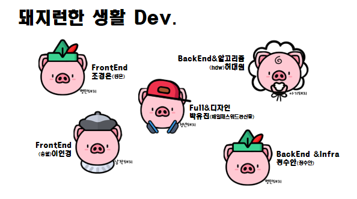
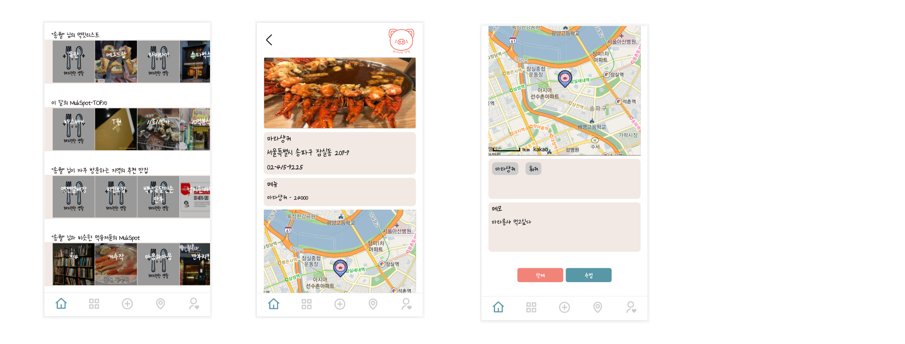
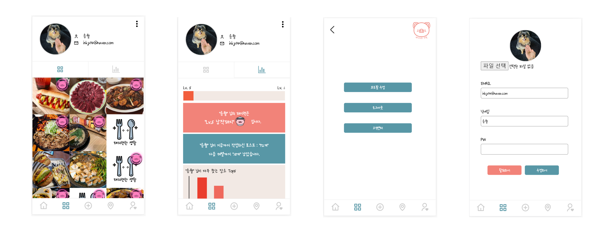
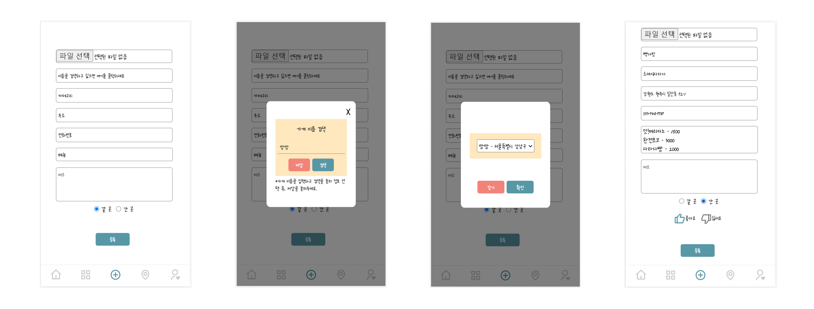
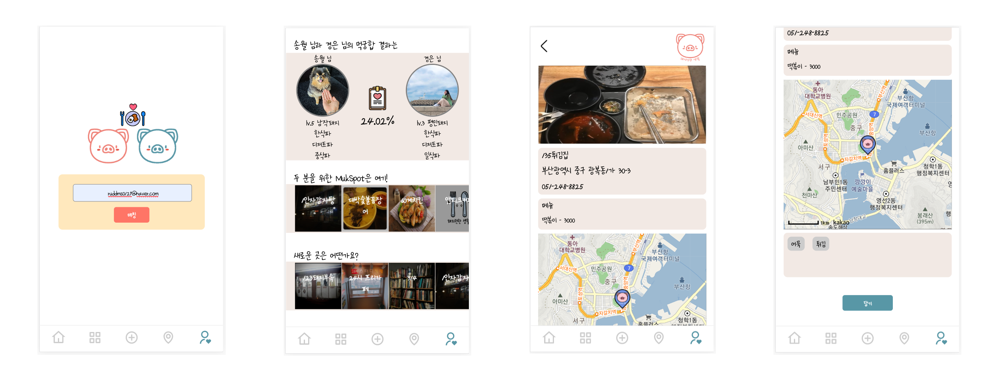

# 돼지런한 생활
-  가고 싶은 맛집을 캡쳐 해놓고 잊어버리는 사람들을 위한 나만의 맛집다이어리
-  빅데이터 분석을 통해 개인 추천 기능 제공
-  친구와의 취향 분석을 통한 추천 기능 제공

# Technologies Used
- React, Java Spring boot 2.3.0 , Python 3.7.0 , MySQL
- Spring Security , JPA , Google Cloud Storage 

# Developer



# How to Run

**Backend**

```sh
cd Backend/PIGGY
./gradlew bootRun
```


**Frontend**

```sh
cd Frontend/piggylife
yarn
yarn start
```


**AWS 주소**

```sh
http://piggylife.co.kr
```


# UI











